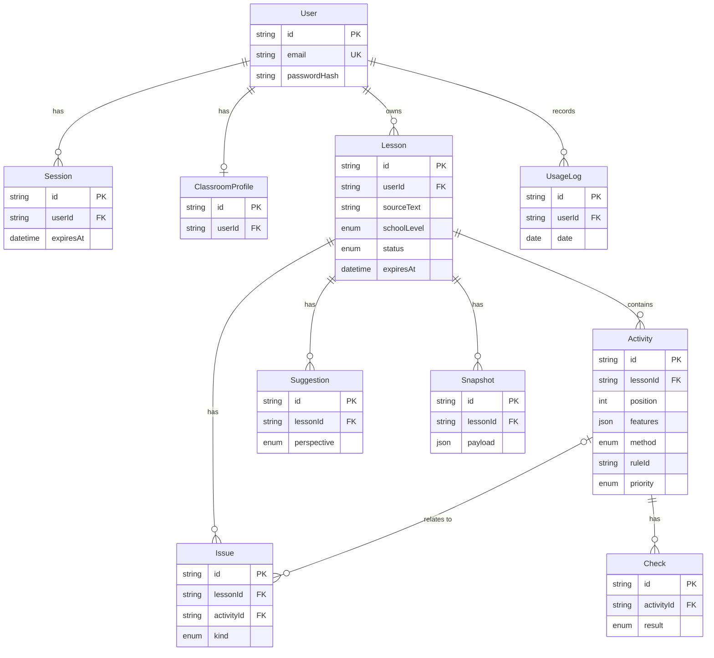

# ER図

```mermaid
erDiagram
  User ||--o{ Session : has
  User ||--o| ClassroomProfile : has
  User ||--o{ Lesson : owns
  User ||--o{ UsageLog : records
  Lesson ||--o{ Activity : contains
  Lesson ||--o{ Issue : has
  Lesson ||--o{ Suggestion : has
  Lesson ||--o{ Snapshot : has
  Activity |o--o{ Issue : "relates to"
  Activity ||--o{ Check : has

  User {
    string id PK
    string email UK
    string passwordHash
  }
  Session {
    string id PK
    string userId FK
    datetime expiresAt
  }
  ClassroomProfile {
    string id PK
    string userId FK
  }
  Lesson {
    string id PK
    string userId FK
    string sourceText
    enum schoolLevel
    enum status
    datetime expiresAt
  }
  Activity {
    string id PK
    string lessonId FK
    int position
    json features
    enum method
    string ruleId
    enum priority
  }
  Issue {
    string id PK
    string lessonId FK
    string activityId FK
    enum kind
  }
  Suggestion {
    string id PK
    string lessonId FK
    enum perspective
  }
  Check {
    string id PK
    string activityId FK
    enum result
  }
  Snapshot {
    string id PK
    string lessonId FK
    json payload
  }
  UsageLog {
    string id PK
    string userId FK
    date date
  }
```
